# Team8

## 比價查詢系統

#### 內容:藉由此查詢系統讓消費者與廠商兩方更清楚得知道商品資訊以及提供一個透明化的溝通橋樑。

# Team8_homework1

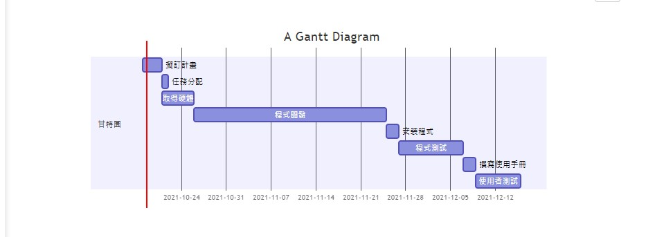

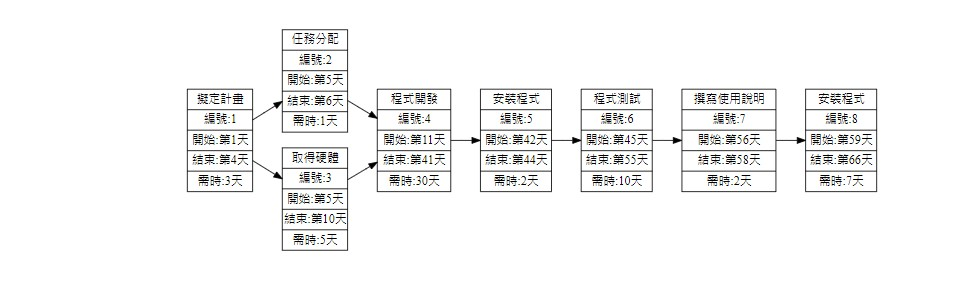

### 組長：c10811838 曾昱翔
### 組員：c10811836 葉慎之
### 組員：c10811842 王柏昌
### 組員：c10811843 劉育綸
### 組員：c10811850 李秉叡
### 組員：c10811852 周柏亨

## 任務
#### 擬訂計畫：曾昱翔、葉慎之、王柏昌、劉育綸、李秉叡、周柏亨
#### 任務分配：曾昱翔、周柏亨
#### 取得硬體：李秉叡、王柏昌
#### 程式開發：周柏亨
#### 安裝程式：劉育綸、李秉叡
#### 程式測試：劉育綸、李秉叡
#### 撰寫使用說明：周柏亨
#### 使用者測試：曾昱翔、葉慎之、王柏昌、劉育綸、李秉叡、周柏亨

#### 題目：比價系統

# Team8_homework2

## 功能分解圖
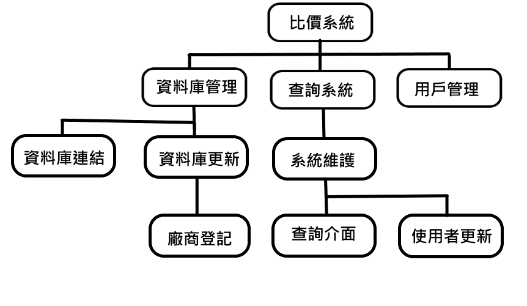

## 功能性需求
#### 1.篩選廠商
#### 2.篩選價格
#### 3.篩選是否能使用優惠券

## 非功能性需求
#### 1.反應時間
#### 2.介面親合度
#### 3.可靠度高

## 使用案例圖(需求分析)
#### 1.管理者可藉由載入用戶資料來管理用戶
#### 2.管理者必須做系統維護
#### 3.廠商登記後須對資料庫進行更新
#### 4.管理者可對資料庫更新及管理
#### 5.使用者可透過查詢系統連結資料庫的資料
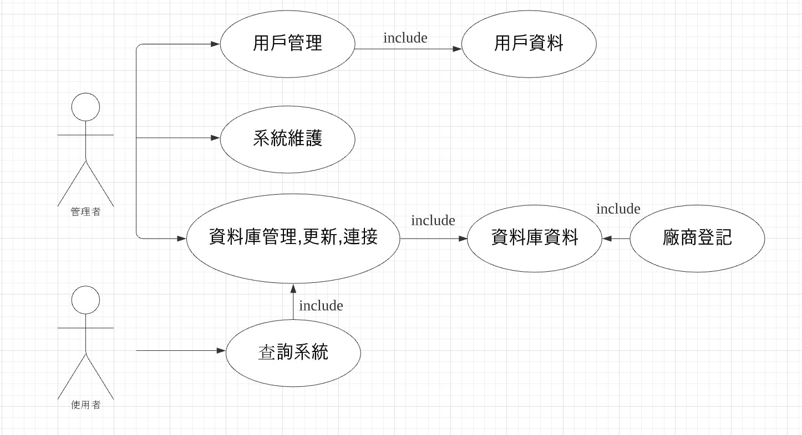

## 使用案例說明
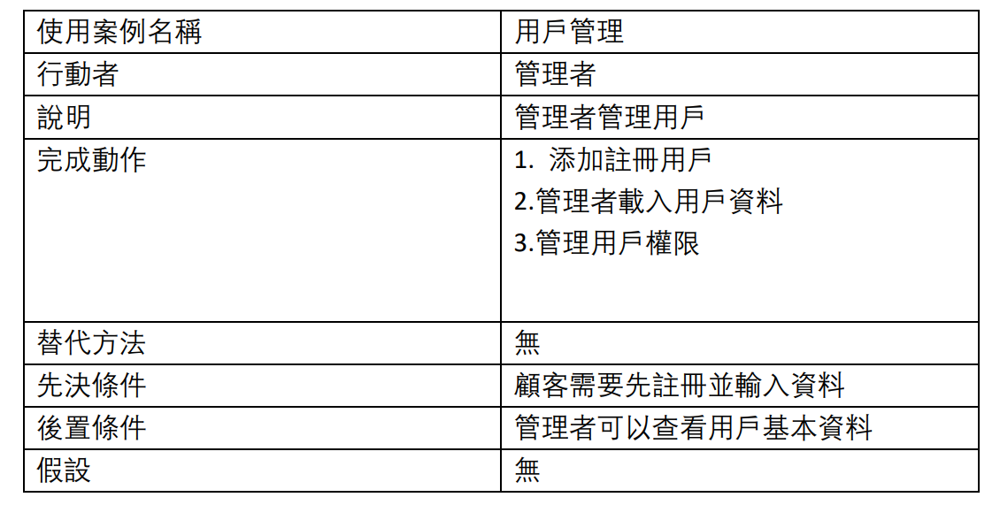
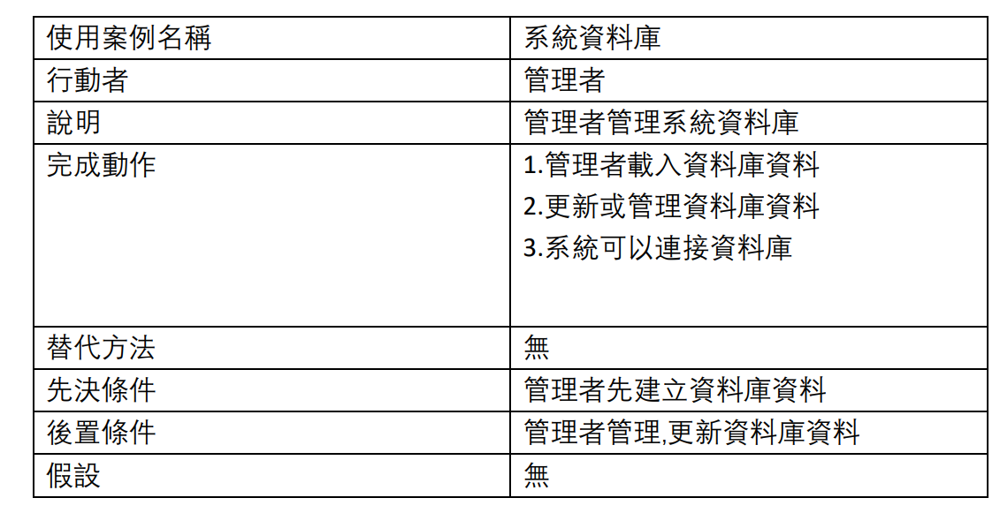
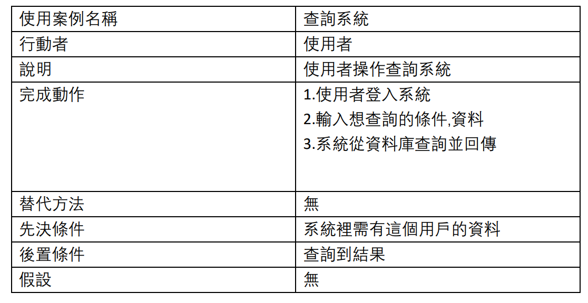

## Team8_homework3

## 系統環境圖(DFD)、DFD圖0
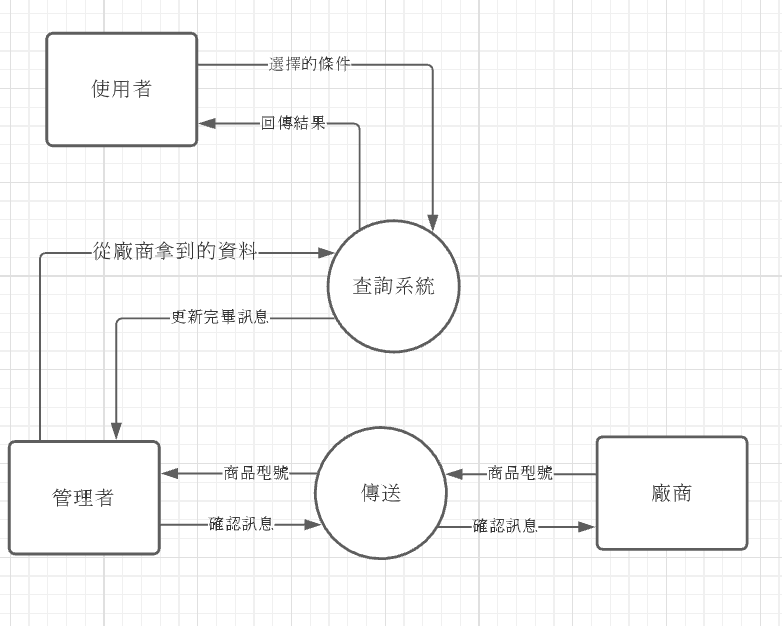
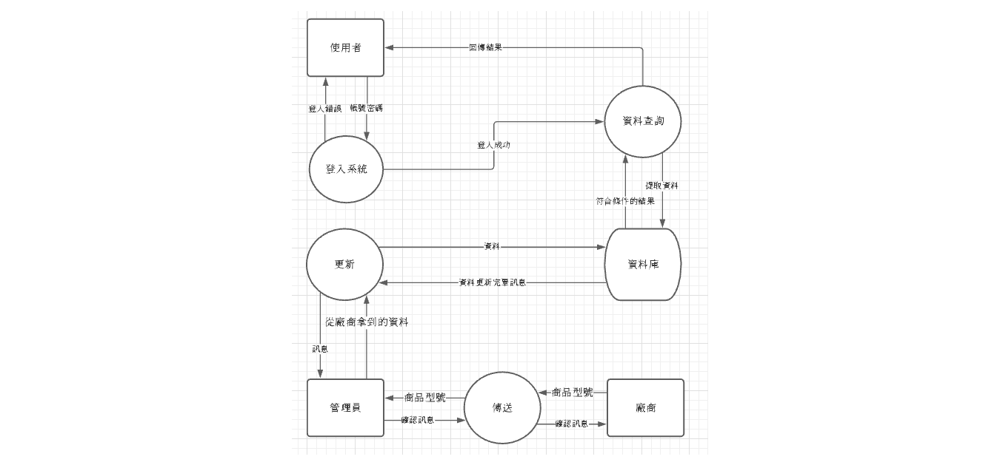

## Team8_homework4

### UML類別圖
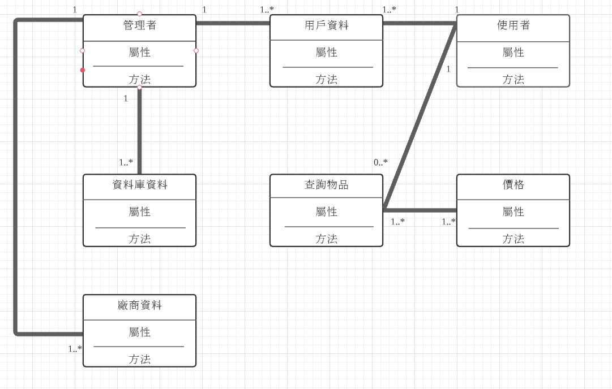

### 循序圖
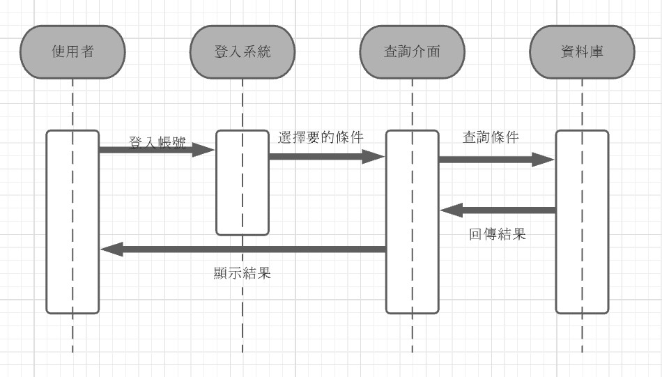

### 活動圖
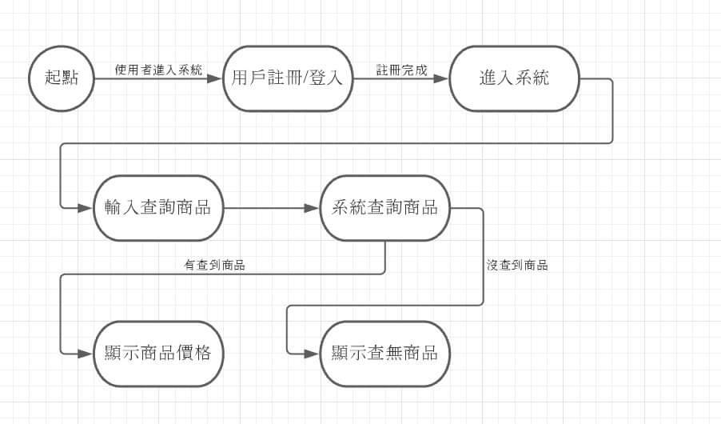
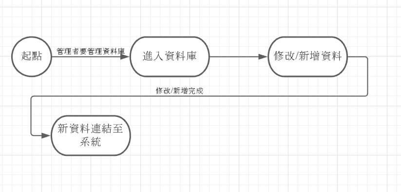
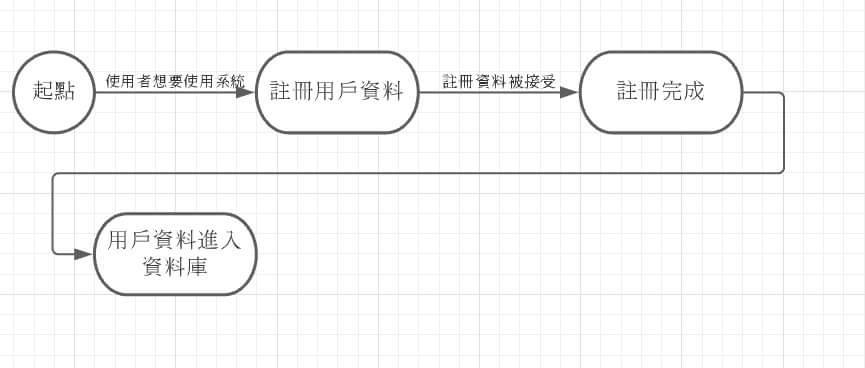

